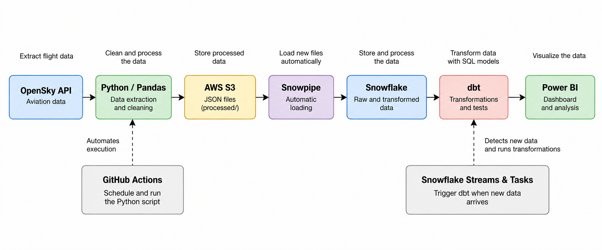
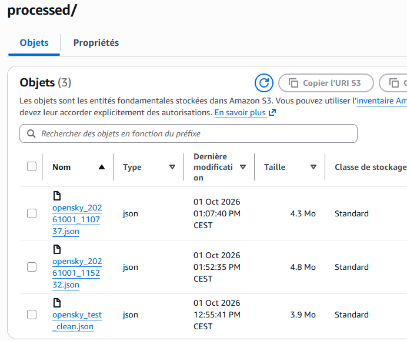
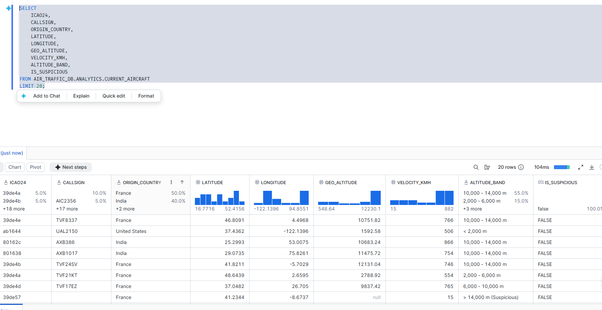

# Air Traffic Data Pipeline

## 1. Project Overview

This project consists of developing an automated data pipeline using aviation data provided by the OpenSky Network API.

The goal is to collect aircraft positions and information, clean the data, store it, and transform it for use in a Power BI dashboard.

The pipeline uses Python, AWS S3, Snowflake, dbt, GitHub Actions, and Power BI.

## 2. Dashboard Demo


The Power BI dashboard allows users to visualize:

- Aircraft positions on an interactive map.
- The number of tracked aircraft.
- The average aircraft speed.
- The average altitude.
- The number of suspicious observations.
- Aircraft distribution by altitude and longitude.
- Various details about each aircraft, such as its identifier and country of origin.

The displayed data comes from the latest available snapshot in Snowflake.

## 3. Pipeline Architecture



The pipeline follows these steps:

**OpenSky API → Python / Pandas → AWS S3 → Snowpipe → Snowflake → dbt → Power BI**

GitHub Actions automates the execution of the Python script (the pipeline runs at a chosen time interval).

Snowpipe loads new JSON files from AWS S3 into Snowflake.

Snowflake Streams and Tasks then trigger dbt transformations when new data arrives.

## 4. How the Pipeline Works

### Step 1 — Data Extraction

A Python script calls the OpenSky Network API to collect aircraft information.

The data includes:

- Aircraft identifier (`icao24`).
- Country of origin.
- Geographic position.
- Altitude.
- Speed.
- Date and time of the snapshot.

### Step 2 — Data Cleaning and Validation

The collected data is processed using Python and Pandas.

The main operations are:

- Removing duplicates.
- Checking missing values.
- Checking the consistency of certain measurements.
- Identifying suspicious speeds, altitudes, and vertical speeds.

Suspicious observations are flagged so they can be analyzed in Power BI.

### Step 3 — Storage in AWS S3

The processed data is exported as JSON files to an AWS S3 bucket.

Each execution creates a timestamped file in the `processed/` folder.



### Step 4 — Data Ingestion into Snowflake

Snowpipe automatically loads new JSON files from AWS S3 into Snowflake.

The data is stored in the `AIR_TRAFFIC_DB.RAW.OPENSKY_RAW` table, in a column of type `VARIANT`.

This step keeps the raw data before transformation.

### Step 5 — Data Transformation with dbt

dbt is used to transform data stored in Snowflake using SQL models.

Two main models are used:

**`stg_opensky`**

This model extracts information from JSON data and converts it into typed SQL columns.

**`current_aircraft`**

This model keeps the latest available snapshot and adds several fields:

- Speed converted to km/h.
- Altitude classification.
- A flag to identify suspicious observations (for example, an aircraft flying at an altitude of 20 km is unusual for a commercial airliner).

dbt tests are also defined to check the uniqueness of identifiers and the presence of certain important data.



### Step 6 — Pipeline Automation

Automation is based on two mechanisms.

**GitHub Actions**

A workflow allows the Python script to run automatically or manually to collect and process data.

**Snowflake Streams & Tasks**

A stream tracks new data arriving in the RAW table.

A first task consumes the new data and records processing information.

A second task runs the dbt transformations.

### Step 7 — Data Visualization with Power BI

Power BI is connected to Snowflake using DirectQuery mode.

The dashboard uses data from the latest available snapshot.

It displays a map of aircraft positions, several key indicators, and an altitude analysis.

## 5. Technologies Used

| Technology | Role |
|---|---|
| Python | Data extraction and processing |
| Pandas | Data cleaning and consistency checks |
| GitHub Actions | Extraction automation |
| AWS S3 | JSON file storage |
| Snowpipe | Automatic data loading into Snowflake |
| Snowflake | Data storage and processing |
| Snowflake Streams & Tasks | Transformation orchestration |
| dbt / SQL | Data modeling, transformation, and testing |
| Power BI | Data visualization and analysis |

## 6. GitHub Repository Structure

```text
air-traffic-data-pipeline/
├── .github/
│   └── workflows/
│       └── test-opensky.yml
├── assets/
│   ├── air_traffic_demo.gif
│   ├── screen_aws.png
│   ├── screen_snowflake.png
│   └── screen_pipeline_schema.png
├── dbt/
│   ├── dbt_project.yml
│   └── models/
│       ├── stg_opensky.sql
│       ├── current_aircraft.sql
│       └── schema.yml
├── notebooks/
│   └── explore_opensky.ipynb
├── snowflake/
│   ├── setup.sql
│   ├── snowpipe.sql
│   └── tasks.sql
├── src/
│   ├── extract_opensky.py
│   └── clean_opensky.py
├── .gitignore
└── README.md
```

The main folders contain:

- `src/`: Python scripts for data extraction and cleaning.
- `notebooks/`: Initial exploration of OpenSky data.
- `snowflake/`: SQL scripts for configuration and automation.
- `dbt/`: SQL models and data quality tests.
- `.github/workflows/`: GitHub Actions workflow.
- `assets/`: Dashboard demo and project images.

## 7. Installation and Configuration

To reproduce this project, several configuration steps are required:

1. Install Python and the dependencies used by the scripts.
2. Configure access to the OpenSky Network API.
3. Create an AWS S3 bucket and configure the required permissions.
4. Configure Snowflake, the S3 integration, and Snowpipe.
5. Deploy the dbt models in Snowflake.
6. Configure Snowflake Streams and Tasks.
7. Configure GitHub Actions secrets to run the pipeline.
8. Connect Power BI to Snowflake data.

The Python, SQL, and dbt scripts are available in this repository.

Credentials and settings specific to AWS, Snowflake, and OpenSky accounts must be configured separately.

## 8. Limitations and Possible Improvements

The project has several limitations:

- Data availability depends on the OpenSky Network API.
- Scheduled GitHub Actions runs may be delayed.
- The dashboard displays the latest available snapshot, not continuous real-time tracking.
- Some steps require manual configuration of cloud services.

Future improvements could include better error handling, pipeline monitoring, and additional automated tests.